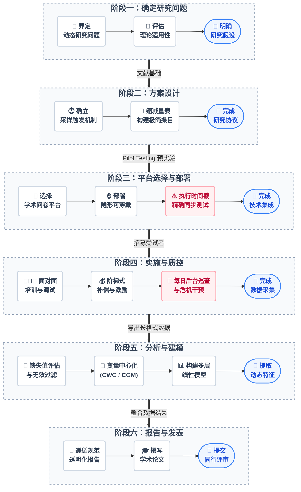

# 引言：EMA 学习指南总览

为了更加直观地展示本教程各个阶段的逻辑衔接，以下流程图梳理了开展一项标准 EMA 研究的全生命周期操作节点。研究者在实际操作中，必须严格按照箭头指示的顺次进行，不可跳过任何质控环节。

*图0-1：EMA 研究全流程全景图。自上而下涵盖了从确立问题、方案设计、数字基建、实地执行、高级统计建模到学术发表的完整生命周期，各阶段内操作自左向右推进。*

## 0.1 教程阶段分布与核心逻辑

开展一项严谨的生态瞬时评估（Ecological Momentary Assessment, EMA）研究，是一项横跨心理测量学、移动计算技术、行为数据科学与高级统计学的系统工程。为了帮助多学科（心理学、精神病学、行为医学、公共卫生等）的入门研究者跨越这一方法学门槛，本教程按照 EMA 研究的真实生命周期，将核心知识体系拆解为 6 个逻辑递进的阶段。

- **阶段一：确定研究问题（第 1 章）**。在数据采集之前，研究者必须深刻理解 EMA 的理论基石及其如何克服传统回顾性评估的回忆偏差，界定目标现象是否需要引入高频动态研究视角。
- **阶段二：方案设计（第 2 章）**。在统计效力与受试者认知负荷之间进行博弈，制定包括固定、随机或事件触发在内的科学采样策略，并精确计算采样频率与时间窗。
- **阶段三：平台选择与部署（第 3 章）**。选择具备高精度时间戳同步能力的软件平台（如 m-Path、SEMA3），并根据研究需求，引入柔性可穿戴传感器（如 HRV、EDA 监测），以构建主客观融合的“数字表型”。
- **阶段四：实施方案与质控管理（第 4 章）**。在长达数周的数据采集期内，受试者的依从性会发生不可逆的衰减。本阶段详细阐述如何通过标准化入组培训、阶梯式经济补偿与后台实时数据监控，最大程度地挽回即将流失的珍贵数据，避免幸存者偏差。
- **阶段五：数据分析与建模（第 5 章）**。面对具有强烈自相关性与嵌套特征（Nested data）的时间序列数据，传统的均值聚合方法完全失效。本阶段指导研究者执行组内/组间中心化，并构建多层线性模型（MLM）以提取动态特征。
- **阶段六：研究报告撰写与学术发表（第 6 章）**。强制要求研究者在撰写学术论文时，严格对照 STROBE-EMA 报告规范进行透明化披露，以确保研究的科学价值与可重复性。（注：生态瞬时干预 EMI 的进阶内容将在后续专章中单独呈现。）

## 0.2 本学习手册使用指南

为了最大化本教程的学术价值与实务指导意义，建议研究者在阅读与实践中遵循以下原则：

- **循序渐进与模块化查阅**：对于 EMA 领域的新手，强烈建议按照第 1 章至第 6 章的线性顺序进行系统阅读，以建立对 EMA 方法学完整生命周期的认知。而具备一定基础的研究者，则可将其作为案头工具书，直接跳转查阅特定的技术模块（例如第 5 章的多层线性模型数据预处理）。
- **理论与实务并重演练**：本手册在阐释底层统计与心理学机制的同时，提供了大量可复现的操作步骤。读者在阅读各章的“具体操作步骤与实务”时，应结合自身的研究课题，同步起草对应的研究协议（Protocol）、绘制依从性监控面板，或编写相应的 R 语言分析脚本。
- **善用开源资源与标准规范**：手册各章节均推荐了经过学术界验证的开源问卷平台（如 m-Path）、条目数据库（如 ESM Item Repository）及统计算法包。读者在推进项目时，应主动接入这些资源，并在最终成文阶段，严格对照第 6 章提供的 STROBE-EMA 规范进行自我核查，确保研究的透明度与可重复性。

## 0.3 参考文献
- Myin-Germeys, I., & Kuppens, P. (2021). *The Open Handbook of Experience Sampling Methodology (2nd Edition)*. KU Leuven.
- Stone, A. A., Shiffman, S., Atienza, A. A., & Nebeling, L. (Eds.). (2007). *The Science of Real-Time Data Capture: Self-Reports in Health Research*. Oxford University Press.
