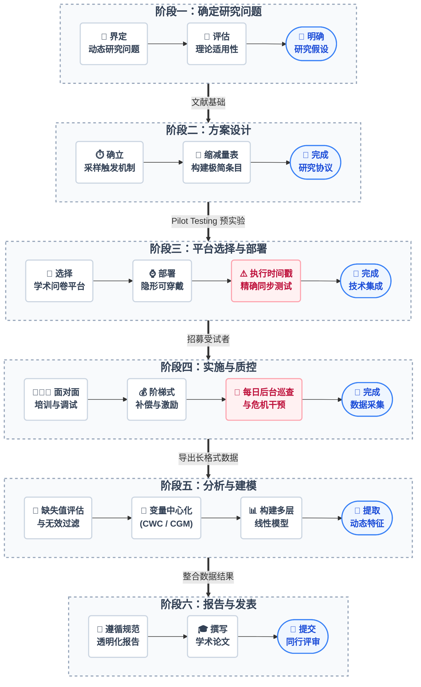

# 引言：EMA 研究指南总览与推荐阅读

生态瞬时评估（Ecological Momentary Assessment, EMA）是一类在自然情境中对个体的即时体验、行为、症状及环境上下文进行重复采样的研究方法。它借助智能手机、可穿戴设备和移动传感器，将研究场景从实验室与诊室延伸至受试者的真实生活，从而克服传统回顾性报告的回忆偏差，捕捉心理与行为随时间波动的微观动态。本教程面向心理学、精神病学、行为医学、公共卫生等领域的研究者，系统梳理从研究问题确立、方案设计、平台部署、伦理审查、实地执行、统计建模到学术发表的完整生命周期。

为了更加直观地展示本教程各个阶段的逻辑衔接，以下流程图梳理了开展一项标准 EMA 研究的全生命周期操作节点。研究者在实际操作中，必须严格按照箭头指示的顺次进行，不可跳过任何质控环节。

*图0-1：EMA 研究全流程全景图。自上而下涵盖了从确立问题、方案设计、数字基建、实地执行、高级统计建模到学术发表的完整生命周期，各阶段内操作自左向右推进。*

## 0.1 教程阶段分布与核心逻辑

开展一项严谨的生态瞬时评估（Ecological Momentary Assessment, EMA）研究，是一项横跨心理测量学、移动计算技术、行为数据科学与高级统计学的系统工程。为了帮助多学科（心理学、精神病学、行为医学、公共卫生等）的入门研究者跨越这一方法学门槛，本教程按照 EMA 研究的真实生命周期，将核心知识体系拆解为 7 个逻辑递进的阶段。

- **阶段一：确定研究问题（第 1 章）**。在数据采集之前，研究者必须深刻理解 EMA 的理论基石及其如何克服传统回顾性评估的回忆偏差，界定目标现象是否需要引入高频动态研究视角。
- **阶段二：方案设计（第 2 章）**。在统计效力与受试者认知负荷之间进行博弈，制定包括固定、随机或事件触发在内的科学采样策略，并精确计算采样频率与时间窗。
- **阶段三：平台选择与部署（第 3 章）**。先明确**平台能力需求**（主观自陈问卷与客观可穿戴数据两条主线），再以清单形式对比市面 **EMA 研究平台**与**客观生理数据采集产品**两大类，国内与国外通过来源列体现、先国内后国外，汇总各平台与产品的来源、优势与劣势（含问卷星 + 微信、EMAI、华为研究者平台、芝兰健康，m-Path、SEMA3、JTrack-EMA+，及华为 Watch D、RingConn、Oura Ring、BioSticker、Empatica E4 等）。
- **阶段四：伦理审查与临床实施规范（第 4 章）**。在正式实施数据采集前，研究者必须通过机构伦理委员会（IRB）审查。本阶段涵盖知情同意特殊考量、数据隐私保护、不良事件监测与管理及临床路径整合等内容。（注：本章节内容同时适用于 EMA 与 EMI 研究。）
- **阶段五：实施方案与质控管理（第 5 章）**。在长达数周的数据采集期内，受试者的依从性会发生不可逆的衰减。本阶段详细阐述如何通过标准化入组培训、阶梯式经济补偿与后台实时数据监控，最大程度地挽回即将流失的珍贵数据，避免幸存者偏差。
- **阶段六：数据分析与建模（第 6 章）**。面对具有强烈自相关性与嵌套特征（Nested data）的时间序列数据，传统的均值聚合方法完全失效。本阶段指导研究者执行组内/组间中心化、构建多层线性模型（MLM）以提取动态特征（不稳定性、惯性等），并按照 REMMES 等规范透明化报告模型细节。
- **阶段七：研究报告撰写与学术发表（第 7 章）**。强制要求研究者在撰写学术论文时，严格对照 STROBE-EMA 报告规范进行透明化披露，以确保研究的科学价值与可重复性。（注：生态瞬时干预 EMI 的进阶内容将在后续专章中单独呈现。）

## 0.2 本学习手册使用指南

为了最大化本教程的学术价值与实务指导意义，建议研究者在阅读与实践中遵循以下原则：

- **循序渐进与模块化查阅**：对于 EMA 领域的新手，强烈建议按照第 1 章至第 7 章的线性顺序进行系统阅读，以建立对 EMA 方法学完整生命周期的认知。而具备一定基础的研究者，则可将其作为案头工具书，直接跳转查阅特定的技术模块（例如第 6 章的多层线性模型数据预处理）。
- **理论与实务并重演练**：本手册在阐释底层统计与心理学机制的同时，提供了大量可复现的操作步骤。读者在阅读各章的“具体操作步骤与实务”时，应结合自身的研究课题，同步起草对应的研究协议（Protocol）、绘制依从性监控面板，或编写相应的 R 语言分析脚本。
- **善用开源资源与标准规范**：手册各章节均推荐了经过学术界验证的开源问卷平台（如 m-Path）、条目数据库（如 ESM Item Repository）及统计算法包。读者在推进项目时，应主动接入这些资源，并在最终成文阶段，严格对照第 7 章提供的 STROBE-EMA 规范进行自我核查，确保研究的透明度与可重复性。

## 0.3 推荐阅读与核心文献

> **版权声明**：为遵守学术版权与开源社区规范，本仓库不直接提供受版权保护的 PDF 电子书原文。强烈建议研究者通过正规学术数据库或所属机构图书馆获取以下核心方法学专著及文献。

本项目的完整参考资料（含第一期与第二期所有章节的文献列表、DOI/PMC 链接、PDF 下载状态）已统一整理至本地 `resources/` 目录。出于版权与合规考虑，该目录（含受版权保护的 PDF 文献）**未随本仓库上传**，读者可通过各文献对应的正规学术数据库或机构图书馆自行获取。

以下为第一期核心推荐阅读的精选摘要，既包含正文中引用的核心专著，也涵盖各章节进一步扩展阅读的代表性文献，便于快速查阅。

### 1. 核心方法学专著

- **The Open Handbook of Experience Sampling Methodology** (2021)
  - *作者*: Myin-Germeys, I., & Kuppens, P.
  - *简介*: ESM 领域的最新开源手册，全面覆盖了从设计到分析的各个环节。
- **Handbook of Research Methods for Studying Daily Life** (2011)
  - *作者*: Mehl, M. R., & Conner, T. S.
  - *简介*: 涵盖日常生活研究方法的经典著作，探讨了多种密集型纵向数据收集技术。
- **The Science of Real-Time Data Capture: Self-Reports in Health Research** (2007)
  - *作者*: Stone, A. A., Shiffman, S., Atienza, A. A., & Nebeling, L.
  - *简介*: 深入探讨实时数据采集（EMA）在临床医学与健康研究中的应用。
- **Experience Sampling Method: Measuring the Quality of Everyday Life** (2007)
  - *作者*: Hektner, J. M., Schmidt, J. A., & Csikszentmihalyi, M.
  - *简介*: 详细介绍 ESM 的历史沿革、抽样策略与问卷设计方法。

### 2. 数据分析与多层线性模型 (MLM) 专著

- **Applied Longitudinal Data Analysis: Modeling Change and Event Occurrence** (2003)
  - *作者*: Singer, J. D., & Willett, J. B.
  - *简介*: 追踪数据分析与多层建模（MLM）的必读经典，对理解 EMA 数据的组内/组间方差有极高指导价值。
- **An Introduction to Multilevel Modeling Techniques** (2020)
  - *作者*: Heck, R. H., & Thomas, S. L.
  - *简介*: 深入浅出的 MLM 建模技术入门，适合对统计学基础要求较高的读者。

### 3. 经典学术论文与综述

*提示：研究者可检索以下经典文献以深入了解 EMA/ESM 在特定领域的理论演进与实证应用。*

- Csikszentmihalyi, M., & Larson, R. (1987). Validity and reliability of the experience-sampling method.
- Shiffman, S., Stone, A. A., & Hufford, M. R. (2008). Ecological momentary assessment. *Annual review of clinical psychology*.
- Trull, T. J., & Ebner-Priemer, U. W. (2013). Ambulatory assessment. *Annual review of clinical psychology*.
- Myin-Germeys, I., Oorschot, M., Collip, D., Lataster, J., Delespaul, P., & van Os, J. (2009). Experience sampling research in psychopathology: opening the black box of daily life. *Psychological medicine*.
- Russell, M. A., & Gajos, J. M. (2020). Annual Research Review: The Ecology of Daily Life-How Susceptibility to Context Unfolds. *Journal of Child Psychology and Psychiatry*.
