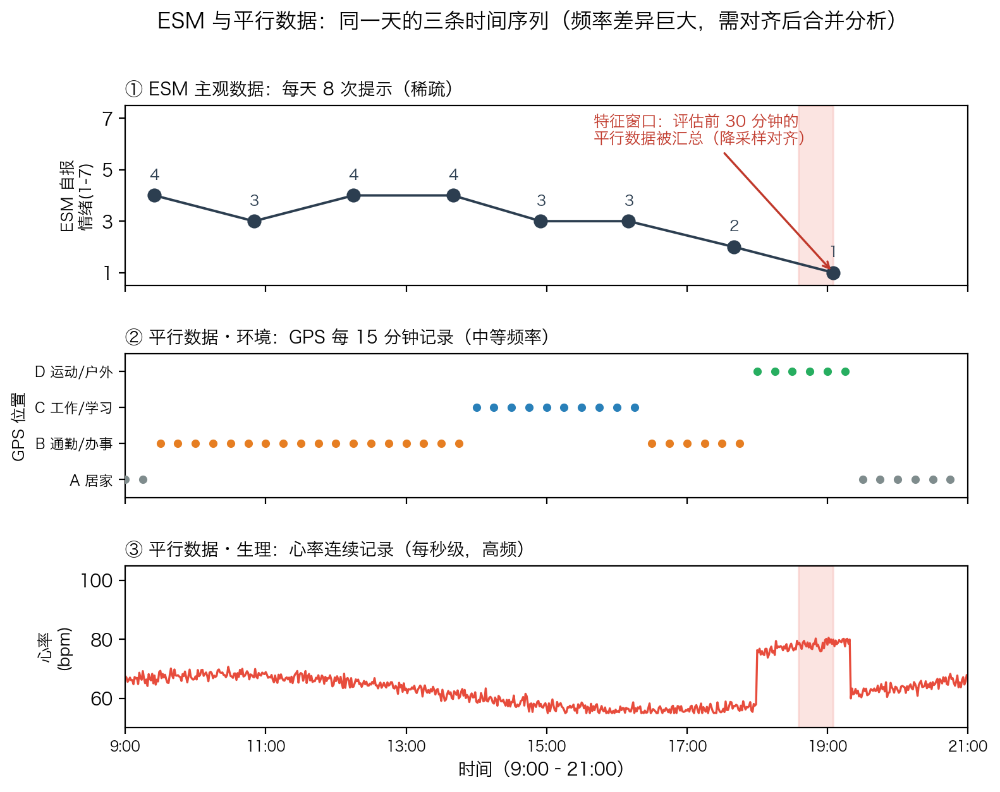
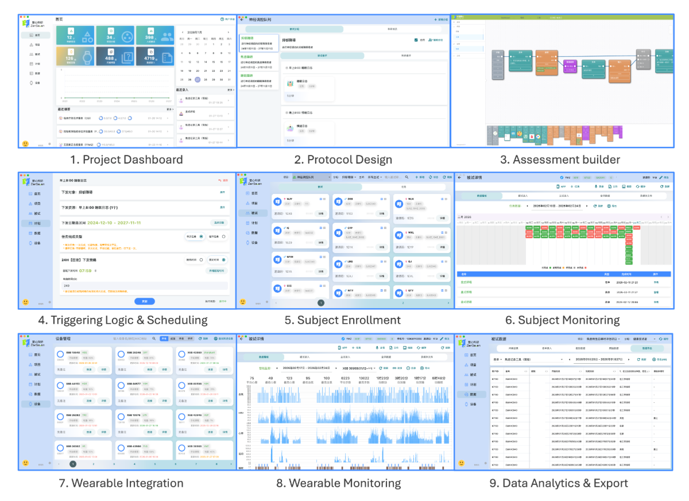
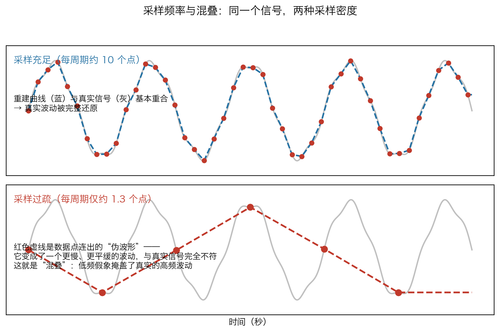

# 第二章：方案设计与采样策略

## 2.1 采样协议的本质：为日常生活的时刻设计抽样方案

在确立 EMA 研究目标之后，研究者面临的核心任务是将抽象的研究问题转化为一套可执行、可复制、可核查的数据采集协议（Protocol）。Shiffman、Stone 与 Hufford（2008）在其奠基性综述中精辟地指出：设计一个 EMA 协议，本质上等同于为个体生命中的“时刻”设计一套抽样方案（Sampling scheme）。与受试者层面的抽样（Participant sampling）不同，EMA 关心的是如何在数周的时间内，从一个人持续流动的体验之流中抽取有代表性、无偏的时刻样本。

因此，采样方案设计的首要原则是：**一切设计决策必须由研究问题驱动**。在设计协议之前，研究者应当首先明确以下问题：

- 目标变量是连续波动的状态（如情绪、疼痛、压力），还是离散发生的事件（如饮酒、惊恐发作、自伤）？
- 需要解析的时间尺度是分钟级、小时级，还是天级甚至周级？
- 需要同时捕捉哪些情境变量（物理地点、社交对象、当前活动）作为后续分析的外部坐标系？

在多学科背景下（心理学、精神病学、行为医学、公共卫生），上述问题的答案差异巨大：精神科关注情绪的动态波动，公卫关注饮食行为的频率与情境，康复医学关注疼痛的昼夜节律。采样方案必须量身定制，而非套用统一模板。

## 2.2 采样触发机制的分类与适用场景

EMA 的采样策略总体上可以划分为两大体系：**事件触发采样**（Event-based sampling）与**时间触发采样**（Time-based sampling）（Shiffman et al., 2008）。前者旨在捕捉特定的离散事件，后者则试图对体验进行更广泛、更具代表性的时间抽样。研究者必须根据目标变量的动态特性进行精准选择（Csikszentmihalyi & Larson, 1987）。

*图2-1：经验取样法（ESM）平行设计示意，展示时间触发与事件触发在自然生活场景中的协同部署与数据采集流程。*

### 2.2.1 时间触发采样（Time-contingent sampling）

时间触发采样由系统在预设的时刻向受试者推送评估提示（Prompt），具体又可分为三种模式（Myin-Germeys & Kuppens, 2021）：

- **固定时间采样（Fixed-interval sampling）**：系统在每天固定的时刻（如早晨 8 点、晚上 10 点）触发评估。此策略极其适合捕捉具有明确昼夜节律的心理或生理变量，例如皮质醇的晨间觉醒反应（CAR）、夜间的疲劳累积程度，或早晚的血压波动。其优势在于提示可预测、受试者容易形成惯性，因而依从性通常更高（Vachon et al., 2019），且等距时间点可满足自相关分析、时间序列分析等对等间隔数据的要求。代价是：可预测性降低了生态效度，受试者可能因预期即将到来的评估而改变行为（反应性），且固定时刻可能系统性地错过或过度代表某些情境（例如提示恰好落在午餐时刻）。
- **随机时间采样（Random-interval sampling）**：系统在预设的采样时段内（如上午 9 点至晚上 9 点）随机触发通知。随机性消除了受试者的预期效应（Anticipation effect），确保采集到的是日常生活切片（情绪、压力、环境上下文）的无偏随机样本，从而提升生态效度。但其代价是受试者无法预测提示时机，负担感上升、依从性可能下降；在极端情况下评估点分布可能不均，导致对全天的代表性不足。
- **半随机采样（Semi-random sampling）**：将一天的清醒时段划分为若干等长的时间窗（如每 2 小时一段），在每个时间窗内随机生成一个提示。它综合了前两者的优点：既有足够的不可预测性以保证生态效度，又能确保全天被均匀覆盖，因此是当前 EMA 研究中最常用的采样方案（Myin-Germeys & Kuppens, 2021）。Stone 与 Shiffman（2002）亦推荐这种“分层随机抽样”（Stratified random sampling）模式，并指出它保证每个时间窗都包含评估，从而令时间窗可以作为后续分析的单元。

### 2.2.2 事件触发采样（Event-contingent sampling）

事件触发采样不依赖系统的自动推送，而是要求受试者在特定的目标行为或临床事件发生时主动进行记录。这一策略犹如在受试者的生活中部署了触发式传感器，专门用于捕获低频但具有极高价值的关键事件，例如精神病学中的惊恐发作、非自杀性自伤行为（NSSI），或行为医学中的抽烟冲动、暴饮暴食行为。

事件触发采样具有独特优势：评估与目标事件精确对齐，不会因时间采样而遗漏罕见事件；同时能够记录事件发生当时的情境、前因与后果。但 Shiffman 等人（2008）也明确指出其关键局限：

- **事件定义困难**。要求受试者“每次进食时记录”时，需要明确口香糖是否算“进食”；疼痛加重到什么程度才算一次“疼痛发作”？事件判定的算法（Algorithm for declaring an event）往往难以界定且至关重要。
- **依从性无法独立核验**。研究者难以判断受试者是否漏记了事件，甚至是否凭空造记。
- **对受试者的主动性与状态要求高**。受试者需自行发起记录；若目标事件本身已使受试者痛苦（如惊恐发作、暴食后），完成问卷的意愿可能进一步下降。
- **事后报告的回忆偏差**。评估只能在事件发生后发起，涉及事件过程的条目本质上是回顾性的。
- **缺乏事件之间的基线信息**。单纯的事件触发设计无法提供“事件之间发生了什么”的背景，因而难以将事件发生时的状态与平时状态进行对比。

### 2.2.3 组合设计（Combination designs）

在实际研究中，不同采样方案往往被组合使用以回答特定的假设（Shiffman et al., 2008）。最经典的组合是“时间触发 + 事件触发”，其逻辑类似于病例对照设计中的“病例”与“对照”：事件触发数据构成“病例”，时间触发数据构成“对照”。例如，Shiffman 等人（2008）引述的暴食研究表明，将暴食发作时的情绪与随机时点的情绪进行对比，可以证明暴食发作确实与更高水平的痛苦情绪特异性相关，而非暴食者整体情绪更差。这种设计也被称为**病例交叉设计**（Case-crossover design）。

此外，时间触发评估还可以用于记录事件的先兆与后续效应（Antecedents and sequelae）。例如，有研究利用时间触发数据证明，戒烟者在复吸（Lapse）前数小时经历着不断升级的情绪困扰，而在成功抵制诱惑后自我效能感则显著下降（Shiffman et al., 2008）。因此，对于需要同时刻画事件发生频率、情境触发因素与前后动态的研究，建议采用”时间触发为主、事件触发为辅”的混合协议。

*图2-2：EMAI 研究者端问卷与评估协议的配置界面（含条目设置、调度与分支逻辑），用于落实采样方案。图片来源：EMAI 官网（[zenseven.cn](https://www.zenseven.cn/html/emai.html)）。*

## 2.3 采样频率与时间窗的确定

### 2.3.1 频率由目标变量的动态特性驱动

采样频率决定了研究的时间分辨率（Resolution），而所需分辨率取决于目标变量波动的速度与理论假设（Shiffman et al., 2008）。对于波动缓慢的变量，高频采样是冗余的：例如睡眠质量只需每天早晨评估一次，反复询问当天多次毫无意义；而对于情绪这类高频波动的状态，较高的采样频率才能提供足够的信息（Myin-Germeys & Kuppens, 2021）。

Myin-Germeys 与 Kuppens（2021）强调，研究者在确定频率之前必须区分：究竟关心**微观过程**（分钟至小时尺度的快速波动）还是**宏观过程**（天至周尺度的缓慢变化）？他们举例说明，一项关注情绪微观动态的研究采用了每天 50 次评估；而其他关注较慢时间尺度变化的研究通常采用每天 10 次评估（需要强调，10 次并非“金标准”，只是常用数值）。

### 2.3.2 信号处理视角：Nyquist-Shannon 定理

Jamalabadi 等人（2025）引入信号处理中的 **Nyquist-Shannon 采样定理** 来回答”采样频率应当多高”这一根本问题。该定理指出：要无失真地重建一个信号，采样频率必须大于信号最高频率成分的两倍（f_sampling > 2 × f_max）；否则将产生”混叠”（Aliasing）现象，使不同频率的信号在数据中无法区分，形成误导性的伪模式。

*图2-3：Nyquist-Shannon 采样定理示意：采样频率不足时产生的混叠（Aliasing）现象，使不同频率的信号在数据中无法区分。引自 Jamalabadi et al.（2025），*Psychological Medicine*，[DOI: 10.1017/S003329172510264X](https://doi.org/10.1017/S003329172510264X)，CC BY 4.0 许可。*

研究者可以利用傅里叶变换（Fourier transform）将时间域上的 EMA 数据转换到频率域，识别目标变量的主导频率成分，从而在理论上确定所需的最小采样频率。Jamalabadi 等人（2025）将该方法应用于两项抑郁症状 EMA 数据集（合计 35,452 个数据点，每名受试者采集 30–90 天），结果发现：以周为间隔的采样即可捕捉抑郁症状的主要波动；但每周与每日尺度的信息仍然具有独特价值。因此，对于常规的抑郁症状监测，每周评估可能已经足够；而在治疗期间或预期症状存在突发动态（Transient dynamics）时，则需要更高频率的数据采集。

需要强调的是，Nyquist 定理给出的是**避免信息丢失的采样下限**，实际采样频率还需要在统计功效与受试者负荷之间进行权衡。过低的采样频率可能因混叠而扭曲真实的症状模式；而过高的采样频率则会压垮受试者，导致依从性下降甚至退出。

### 2.3.3 采样时间窗与响应窗口

- **覆盖清醒时段**：理想情况下，采样应覆盖受试者的全部清醒时间。Shiffman 等人（2008）指出，若仅将评估限制在狭窄时段（如上午 10 点至晚上 10 点），将错失清晨与深夜这些可能包含重要且显著不同体验的时间。Myin-Germeys 与 Kuppens（2021）建议根据目标人群的实际作息设置首末评估时间。
- **依从性的日内节律**：一项对十个 ESM 数据集、1,717 名不同精神健康状况个体的再分析显示，依从性最高的时段是中午 12 点至下午 1:30（约 83%），最低的是清晨 7:30 至 9 点（约 56%）（Rintala et al., 2019）。这一发现提示研究者应谨慎安排清晨的采样。
- **响应窗口（Response window）**：指提示发出后允许受试者完成问卷的时限。多数研究允许最长 30 分钟，但较长的响应窗口会降低数据的可靠性——受试者可能等到更“平静”的时刻再作答，从而引入情绪相关的选择性偏差（Myin-Germeys & Kuppens, 2021）。
- **采样持续天数**：一项基于 79 个数据集的元分析显示，ESM 研究的时长从 1 天到 150 天不等，平均 11.2 天，68% 的研究持续 2–10 天（Vachon et al., 2019）。研究者应确保采样天数同时覆盖工作日与周末，以消除星期效应。

## 2.4 受试者负荷与依从性

### 2.4.1 依从性的实证基准

依从性（Compliance）通常定义为受试者实际完成的评估次数占计划评估次数的比例。高依从性对于 EMA 数据质量至关重要：缺失数据往往并非随机缺失，而可能与症状状态、情境相关，从而扭曲样本的代表性（Shiffman et al., 2008）。

多项元分析为研究者提供了依从性基准：

- Davanzo 等人（2023）对 28 项边缘型人格障碍（BPD）EMA 研究（共 2,052 名受试者）的元分析发现，合并依从率为 **79%**；且未发现研究设计特征（每日提示频率、条目数、响应窗口、设备类型、经济激励等）与依从率之间存在显著关联。
- Wrzus 与 Neubauer（2023）横跨多个研究领域、基于 477 篇文章（677,536 名受试者）的元分析同样报告了约 79% 的依从率，并发现提供**经济激励**可显著提高依从性，而每日评估次数与依从性并无关联。
- Ono 等人（2019）在慢性疼痛领域的个体参与者数据（IPD）元分析中观察到平均 85% 的完成率，并发现年轻受试者的完成率低于年长者，且完成率随研究进展逐日下降。

这些发现传递了一个重要信息：**“更多更密的采样一定会压垮受试者”并非绝对成立**。标准化设计特征本身似乎并非依从性的决定性因素；相反，依从性更可能与动机（如经济激励、研究者支持）、个体差异及研究实施过程有关。

### 2.4.2 问卷密度与完成时间

虽然每日提示频率未必直接损害依从性，**问卷密度（每次评估的条目数）** 却有明确的影响。Eisele 等人（2022）在一项 2 × 3 因素设计实验中将受试者随机分配到 30 条目或 60 条目问卷、每天 3/6/9 次评估、持续 14 天，结果发现更长的问卷会显著增加感知负荷、降低依从性并诱发粗心作答（Careless responding）；而采样频率从 3 次提升至 9 次并未带来同样的负面后果。Raugh 等人（2019）也建议，瞬时问卷的完成时间应控制在 **1–3 分钟**之间，条目过多会使依从性降至不可接受的水平。

Myin-Germeys 与 Kuppens（2021）列举的示例研究表明，典型 ESM 研究每份问卷约含 13–46 个条目不等；但关键的权衡原则是：**采样频率越高，单次问卷越应精简**。例如，一项每天采样 50 次的超密集研究，其问卷仅包含 7 个条目。

### 2.4.3 依从性的个体差异与社会决定因素

依从性并非在所有人群中均匀分布。Sun 等人（2025）对 48 项研究的范围综述（Scoping review）系统梳理了社会决定因素（Social Determinants of Health, SDoH）与 EMA 依从性的关系：

- **年龄**：多数研究（6/8）发现老年人依从性更高，可能与其更充裕的时间有关；而年轻、工作作息不稳定的受试者依从性较低。
- **性别**：多数研究（7/8）报告女性依从性高于男性。
- **社会经济地位与教育**：低收入、缺乏稳定住房以及工作场所限制手机使用均会妨碍依从；部分研究发现更高教育水平与更高依从性相关。
- **语言与文化**：非母语受试者可能面临语言障碍；使用语言友好的条目与符合文化的程序能提高依从性。
- **社会情境**：在手机使用被视为不合时宜的场合（如宗教仪式、正式会议），受试者难以响应提示。

这些发现提示研究者：在设计阶段就应预判目标人群的特征，并在培训、激励与提示时段安排上作出相应调整，以避免系统性的选择偏差。此外，针对老年等特殊人群，Kim 等人（2020）的综述指出，感官缺陷（如听力下降）与技术不熟悉是老年受试者参与 EMA 的主要障碍，研究者应提供及时的提示提醒、简化操作培训，并可能需要在协议中引入更宽裕的响应时间。

### 2.4.4 反应性（Reactivity）

反应性是指“评估行为本身改变被测量行为或体验”的倾向。Shiffman 等人（2008）指出，自监控文献表明当受试者正在尝试改变目标行为、且评估记录发生在其行为执行之前时，评估本身可能产生干预效应；但对于纯粹的观察性 EMA 研究，多数证据并未发现显著的反应性效应。最严格的检验来自一项将疼痛受试者随机分配至每天 0、3、6 或 12 次电子日记评估的研究，结果未发现疼痛评分随评估强度增加而系统性改变（Shiffman et al., 2008）。因此，对于观察性 EMA 研究，研究者不必过度担心反应性，但在涉及行为改变的干预研究中应保持警觉。

## 2.5 问卷条目的极简化设计

- **采用单条目或极简版量表**：摒弃传统的长篇量表，优先选用经过验证的单条目（Single-item）或短格式量表。单次评估的完成时间应严格控制在 1–3 分钟以内（Raugh et al., 2019）。
- **检索验证性条目库**：访问 [ESM Item Repository](https://www.esmitemrepository.com/) 等开源数据库，直接引用已经在过往 EMA 研究中经过严格信效度验证的短格式条目，以在极简条件下维持心理测量学质量。
- **设计情境锚点**：在问卷开头加入简短的情境核对条目，例如“你现在在哪里？”“你和谁在一起？”“你正在做什么？”，为后续的内部心理状态或健康行为分析提供外部的物理与社会坐标系。

## 2.6 采样方案设计的操作步骤

对于准备制定 EMA 协议的研究者，无论处于哪个学科领域，建议按照以下步骤推进：

- **步骤一：确定目标变量的动态特征与时间分辨率**。依据既往文献或前期数据，判断目标变量是高频波动的状态还是低频离散的事件，并明确研究需要解析的时间尺度（分钟级/小时级/天级）。可使用信号处理中的频谱分析辅助判断目标变量的主导频率（Jamalabadi et al., 2025）。
- **步骤二：选择采样触发机制与组合方案**。根据变量特性，在固定、随机、半随机与事件触发四种方案中选择；若研究需要同时刻画事件的发生及其情境背景，则设计“时间触发为主、事件触发为辅”的组合协议。
- **步骤三：确定采样频率、时间窗与响应窗口**。在“统计分辨率”与“受试者负荷”之间权衡：对情绪等高频波动变量，每天 3–5 次随机采样通常已能提供足够的统计学信息增益；对日常压力总结或饮食行为记录，每天 1–3 次即可。采样周期一般设定为 7–14 天，并确保覆盖工作日与周末；响应窗口建议设置在 30 分钟以内。
- **步骤四：精简问卷条目并设计情境锚点**。将单次完成时间压缩至 1–3 分钟，优先引用 ESM Item Repository 等条目库中的验证性短条目，并加入 3–4 个情境核对条目。
- **步骤五：进行小样本预实验（Pilot）**。在正式研究前招募 5–10 名目标人群受试者运行 3–7 天，检验问卷完成时间、条目理解度、设备兼容性与受试者负担，并据此调整采样频率与条目内容。
- **步骤六：依据报告规范预登记协议**。在正式实施前，参照 CREMAS 报告规范（Liao et al., 2016）预登记采样方案、提示机制与依从性定义，确保后续论文的透明化报告。

## 2.7 协议报告规范与透明化

采样方案的设计决策必须在论文中透明化报告，否则将严重损害研究的可重复性。Stone 与 Shiffman（2002）提出的瞬时自我报告报告指南要求研究者至少披露：采样方案的理论依据、采样密度与时间表、提示与记录方法、受试者主动发起条目（事件条目）的定义、非响应（Nonresponse）的处理方式、响应延迟允许范围、“及时响应”的界定、依从率（完成评估次数占计划次数的比例）及其客观评估方式、受试者培训与监测程序、缺失数据的处理标准。Liao 等人（2016）进一步提出的 **CREMAS** 报告规范则基于对 13 项青少年饮食与体力活动 EMA 研究的系统回顾，构建了覆盖抽样与测量、时间表、技术与实施、提示策略、响应与依从性五大领域的核查清单。其中与采样设计直接相关的条目包括：明确提示策略类型（事件触发/间隔触发/混合）及间隔触发的调度方式（固定/随机/混合间隔）、按工作日与周末分别报告每日提示频率、报告计划投递与实际接收的提示数量、报告从提示发出到回答的潜伏期（Latency）、以及报告依从率及其与人口学或时变变量的关联。其详细条目将在第七章的报告规范部分展开讨论。

## 2.8 参考文献

- Csikszentmihalyi, M., & Larson, R. (1987). Validity and reliability of the experience-sampling method. *The Journal of Nervous and Mental Disease*, 175(9), 526–536. [DOI: 10.1097/00005053-198709000-00004](https://doi.org/10.1097/00005053-198709000-00004)
- Davanzo, A., d'Huart, D., Seker, S., Moessner, M., Zimmermann, R., Schmeck, K., & Behn, A. (2023). Study features and response compliance in ecological momentary assessment research in borderline personality disorder: Systematic review and meta-analysis. *Journal of Medical Internet Research*, 25, e44853. [DOI: 10.2196/44853](https://doi.org/10.2196/44853)
- Eisele, G., Vachon, H., Lafit, G., Kuppens, P., Houben, M., Myin-Germeys, I., & Viechtbauer, W. (2022). The effects of sampling frequency and questionnaire length on perceived burden, compliance, and careless responding in experience sampling data in a student population. *Assessment*, 29(2), 136–151. [DOI: 10.1177/1073191120957102](https://doi.org/10.1177/1073191120957102)
- Jamalabadi, H., Koosha, T. A., Stocker, E., et al. (2025). Optimizing the frequency of ecological momentary assessments using signal processing. *Psychological Medicine*, 55, e358. [DOI: 10.1017/S003329172510264X](https://doi.org/10.1017/S003329172510264X)
- Kim, H., Kim, S., Kong, S. S., Jeong, Y.-R., Kim, H., & Kim, N. (2020). Possible application of ecological momentary assessment to older adults' daily depressive mood: Integrative literature review. *JMIR Mental Health*, 7(6), e13247. [DOI: 10.2196/13247](https://doi.org/10.2196/13247)
- Liao, Y., Skelton, K., Dunton, G., & Bruening, M. (2016). A systematic review of methods and procedures used in ecological momentary assessments of diet and physical activity research: CREMAS. *Journal of Medical Internet Research*, 18(6), e151. [DOI: 10.2196/jmir.4954](https://doi.org/10.2196/jmir.4954)
- Myin-Germeys, I., & Kuppens, P. (Eds.). (2021). *The Open Handbook of Experience Sampling Methodology* (2nd ed.). Center for Research on Experience Sampling and Ambulatory Methods Leuven (REAL), KU Leuven.
- Ono, M., Schneider, S., Junghaenel, D. U., & Stone, A. A. (2019). What affects the completion of ecological momentary assessments in chronic pain research? An individual participant data meta-analysis. *Journal of Medical Internet Research*, 21(2), e11398. [DOI: 10.2196/11398](https://doi.org/10.2196/11398)
- Raugh, I. M., Chapman, H. C., & Strauss, G. P. (2019). Psychophysiological applications of ecological momentary assessment in psychiatric populations. *Psychological Assessment*, 31(3), 304–317. [DOI: 10.1037/pas0000651](https://doi.org/10.1037/pas0000651)
- Rintala, A., Wampers, M., Myin-Germeys, I., & Viechtbauer, W. (2019). Response compliance and predictors thereof in studies using the experience sampling method. *Psychological Assessment*, 31(2), 226–235. [DOI: 10.1037/pas0000662](https://doi.org/10.1037/pas0000662)
- Shiffman, S., Stone, A. A., & Hufford, M. R. (2008). Ecological momentary assessment. *Annual Review of Clinical Psychology*, 4, 1–32. [DOI: 10.1146/annurev.clinpsy.3.022806.091415](https://doi.org/10.1146/annurev.clinpsy.3.022806.091415)
- Stone, A. A., & Shiffman, S. (2002). Capturing momentary, self-report data: A proposal for reporting guidelines. *Annals of Behavioral Medicine*, 24(3), 236–243. [PMID: 12173681](https://pubmed.ncbi.nlm.nih.gov/12173681/)
- Sun, Y., et al. (2025). Associations between social determinants of health and engagement in mobile-based ecological momentary assessment: A scoping review. *Journal of Medical Internet Research*, 27, e69831. [DOI: 10.2196/69831](https://doi.org/10.2196/69831)
- Vachon, H., Viechtbauer, W., Rintala, A., & Myin-Germeys, I. (2019). Compliance and retention with the experience sampling method over the continuum of severe mental disorders: Meta-analysis and recommendations. *Journal of Medical Internet Research*, 21(12), e14475. [DOI: 10.2196/14475](https://doi.org/10.2196/14475)
- Wrzus, C., & Neubauer, A. B. (2023). Ecological momentary assessment: A meta-analysis on designs, samples, and compliance across research fields. *Assessment*, 30(3), 825–846. [DOI: 10.1177/10731911211067538](https://doi.org/10.1177/10731911211067538)
