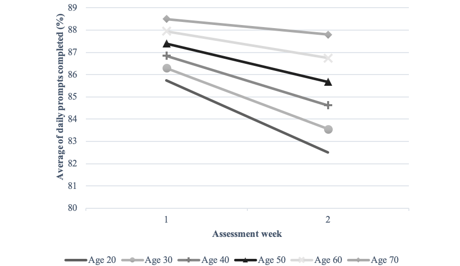

# 第五章：实施方案与质控管理

## 5.1 依从性衰减机制与幸存者偏差

在执行为期数周的生态瞬时评估（EMA）项目时，无论是进行全民饮食追踪还是抑郁症的情绪监测，研究者通常会面临一个极其严峻的方法学挑战：受试者的依从性（Compliance）会随着时间的推移出现不可逆的衰减。在研究的前三天，受试者往往能保持高达 90% 的数据回复率，但随着新鲜感的消退及日常生活的干扰，漏填和随意作答（如调查疲劳引发的直线式打分）的现象会显著增加。

这种衰减并非个案，而是 EMA 研究中的普遍规律。Ono 等人（2019）对 13 个慢性疼痛 EMA 数据集、701 名患者进行的个体参与者数据（IPD）元分析发现，总体完成率为 85%，但完成率随研究天数的推进显著下降（P < .001）。Rintala 等人（2019）对十个 ESM 数据集的再分析也显示，依从性从首日的 78% 左右逐日下滑，至第 5 天已降至约 73%。更值得警惕的是，这种下降往往**并非随机**：Ono 等人（2019）发现年轻受试者的完成率不仅整体更低，其随时间衰减的速度也显著快于年长者（年龄 × 研究天数的交互作用，P = .02）。

临床与社会学观察同样表明，往往是那些抑郁症状加重、处于重度社交退缩状态，或者正处于极高工作压力下的受试者最先放弃填答问卷。这种数据的缺失绝非"完全随机缺失（MCAR）"。如果不加以严格的干预，研究者最终收集到的数据集将仅仅反映个体状态较好、较空闲时的片段，从而在最终的统计模型中引入严重的幸存者偏差——即事后保留在数据中的样本系统地偏离了最初的目标人群。

## 5.2 依从性的实证基准与影响因素

在设计质控方案之前，研究者需要先了解依从性的"正常水平"及其主要影响因素，以建立合理的预期与干预阈值。

**依从性基准**。多项元分析提供了可参照的基准：Ono 等人（2019）报告慢性疼痛领域平均完成率约 85%；Rintala 等人（2019）报告精神心理领域平均响应率约 78%；Davanzo 等人（2023）对 28 项边缘型人格障碍（BPD）EMA 研究的元分析显示合并依从率为 79%。总体而言，**EMA 研究可接受的依从性通常落在 70%–85% 区间**，过高或过低的基线都值得研究者核查其定义与计算方式。

**影响因素**。基于上述元分析，研究者应重点关注以下三类因素：

- **年龄**：Ono 等人（2019）发现年轻受试者完成率更低且衰减更快，可能与其更易分心、粗心作答有关；而针对老年人群的 EMA 研究则长期偏少。Kim 等人（2020）对 38 项研究的整合综述发现，老年受试者的非依从多源于技术问题、感官/认知障碍等"客观障碍"，而非意愿不足，因此通过合理的辅助手段可以显著改善其完成率。
- **研究时长与任务负荷**：完成率随研究天数推移而下降（Ono et al., 2019）；问卷密度（单次条目数）也会显著影响数据质量与依从性（Eisele et al., 2022）。Okifuji 等人建议将评估周期限制在约 1 周，或在需要长期监测时采用"测量爆发"（Measurement burst）设计——即在较长时间跨度内重复多个短暂、密集的 EMA 周期。
- **经济激励**：多项元分析一致表明，提供经济激励的 EMA 研究依从性显著更高（Wrzus & Neubauer, 2023；Ono et al., 2019）。这一证据为阶梯式补偿方案提供了直接的理论与实证支持。

## 5.3 质量控制与依从性管理的实操步骤

为了对抗依从性疲劳，研究团队必须在项目启动之初就与受试者建立稳固的"心理契约"，并设计一套涵盖前置干预、经济激励与实时监控的多维度质量控制机制。Russell 与 Gajos（2020）在其综述中深刻指出，针对脆弱群体或高负荷人群，单纯依靠研究结束时的一次性报酬往往缺乏持续的驱动力，必须引入阶梯式激励与临床关怀。

具体实施中，研究团队应严格遵循以下步骤：

- **步骤一：标准化入组培训（Onboarding）**。研究人员应当与每位受试者进行 15-30 分钟的面对面（或视频）沟通。亲自协助他们在个人智能手机上安装相应的应用程序，并逐一排查操作系统的通知权限（将 App 加入电池优化白名单），确保推送不被系统底层拦截。同时，指导受试者完成首次测试填答，以消除初期的技术阻力。这一环节对于老年受试者尤为重要——Kim 等人（2020）发现，技术问题与用户错误是老年人群非依从的首要原因，研究者应主动提供适应性支持：如为视觉障碍者准备更大字体的设备或放大镜、为手部灵活性受限者提供触控笔、允许受试者选择自己熟悉的操作系统，并确认设备在离线状态下仍可完成记录。
- **步骤二：部署阶梯式补偿方案（Tiered Compensation）**。摒弃一次性结算的模式，将总体预算拆分为三个层级：基础参与费（保障底线）、单次成功填答的微奖励（提供即时正强化），以及针对高完成率（如总体回复率超过 80%）的满勤奖金。经济激励对依从性的提升作用已得到元分析证据支持（Wrzus & Neubauer, 2023；Ono et al., 2019），这种机制能够有效利用行为心理学中的正强化原理，促使受试者在疲惫时依然愿意完成任务。
- **步骤三：实施每日动态数据监控**。配备专门的数据监控人员，使用 R 语言脚本（如开源的 [EMA-tools](https://github.com/joshuallo/EMA-tools)）每天定时拉取全员的完成率数据。监控前需明确定义"依从性"的计算口径（见 5.5 节），以便实时核算每位受试者的累计完成率与"及时响应"情况。
- **步骤四：危机预警与人工介入**。一旦系统发出预警（如某位受试者连续三次未能响应），研究助理需在 24 小时内，通过温和且充满关怀的话术主动介入。询问受试者是否遇到了技术困难或需要支持，从而在流失边缘挽回珍贵的数据样本。Ono 等人（2019）强调，与受试者的频繁接触以保持其参与动机，往往比单纯压缩任务负荷更为关键。在条件允许的情况下，为受试者提供基于自身数据的个性化反馈报告（如图表形式的情绪周报或运动轨迹分析），将外部任务转化为内在的自我探索动机。

*图5-1：不同年龄组受试者的 EMA 完成率随评估周推进的变化，显示年轻组完成率更低且随时间衰减更快。引自 Ono et al.（2019），*Journal of Medical Internet Research*，[DOI: 10.2196/11398](https://doi.org/10.2196/11398)，CC BY 4.0 许可。*

## 5.4 特殊人群与差异化适配

依从性并非在所有人群中均匀分布，质控方案应针对目标人群的特征进行差异化设计。

**老年人群**。Kim 等人（2020）的整合综述总结了老年受试者非依从的四大类原因：技术问题或用户错误、与日常生活竞争性需求的逻辑错配、健康相关的障碍（感官、认知或功能损害）、以及携带设备或完成评估的不适。相应的适配策略包括：简化条目（高频重复测量下优先采用单条目，而非冗长的多条目量表）、使用蜂鸣式提示提醒、提供大字界面与离线记录功能、以及在方案设计时为老年人预留更宽裕的响应时间。

**社会决定因素（SDoH）差异人群**。Sun 等人（2025）对 48 项研究的范围综述显示，低收入、缺乏稳定住房、工作作息不稳定、非母语使用等社会决定因素均会系统性地影响 EMA 依从性，且其作用具有强烈的**情境依赖性**——例如失业既可能因时间充裕而提高依从性，也可能因竞争性需求而降低依从性。因此，研究者应在设计阶段预判目标人群的社会文化特征，采取语言友好、文化适配的问卷与培训，将提示时段与受试者的作息错峰，并理解在某些社会情境（如宗教仪式、正式会议）中手机使用受限的现实。

## 5.5 依从性的定义、计算与透明化报告

**定义与计算**。依从性（Compliance）通常定义为受试者实际完成的评估次数占计划评估次数的比例。更精细的口径还包括"及时响应率"（在预设响应窗口内完成的评估占比）。然而，Kim 等人（2020）在综述中发现，不同研究对依从性/脱落率的定义差异极大：有的以完成比例衡量，有的采用固定阈值（如 30%、50% 甚至 100%）来判定受试者是否"达标"，28.9% 的研究甚至未提供清晰的脱落定义。这种不一致严重损害了研究间的可比性。

**透明化报告**。为使依从性数据可比、可核查，研究者应在论文中明确报告：依从性的计算方式、及时响应的判定标准、依从率随时间的变化趋势、缺失数据的处理方式，以及非依从的已知原因。Stone 与 Shiffman（2002）的瞬时自我报告报告指南与 Liao 等人（2016）的 CREMAS 规范均将依从性报告列为强制条目，其详细要求已在第二章展开讨论。

## 5.6 参考文献

- Davanzo, A., d'Huart, D., Seker, S., et al. (2023). Study features and response compliance in ecological momentary assessment research in borderline personality disorder: Systematic review and meta-analysis. *Journal of Medical Internet Research*, 25, e44853. [DOI: 10.2196/44853](https://doi.org/10.2196/44853)
- Eisele, G., Vachon, H., Lafit, G., et al. (2022). The effects of sampling frequency and questionnaire length on perceived burden, compliance, and careless responding in experience sampling data in a student population. *Assessment*, 29(2), 136–151. [DOI: 10.1177/1073191120957102](https://doi.org/10.1177/1073191120957102)
- Kim, H., Kim, S., Kong, S. S., et al. (2020). Possible application of ecological momentary assessment to older adults' daily depressive mood: Integrative literature review. *JMIR Mental Health*, 7(6), e13247. [DOI: 10.2196/13247](https://doi.org/10.2196/13247)
- Liao, Y., Skelton, K., Dunton, G., & Bruening, M. (2016). A systematic review of methods and procedures used in ecological momentary assessments of diet and physical activity research: CREMAS. *Journal of Medical Internet Research*, 18(6), e151. [DOI: 10.2196/jmir.4954](https://doi.org/10.2196/jmir.4954)
- Ono, M., Schneider, S., Junghaenel, D. U., & Stone, A. A. (2019). What affects the completion of ecological momentary assessments in chronic pain research? An individual participant data meta-analysis. *Journal of Medical Internet Research*, 21(2), e11398. [DOI: 10.2196/11398](https://doi.org/10.2196/11398)
- Rintala, A., Wampers, M., Myin-Germeys, I., & Viechtbauer, W. (2019). Response compliance and predictors thereof in studies using the experience sampling method. *Psychological Assessment*, 31(2), 226–235. [DOI: 10.1037/pas0000662](https://doi.org/10.1037/pas0000662)
- Russell, M. A., & Gajos, J. M. (2020). Annual research review: Ecological momentary assessment studies in child psychology and psychiatry. *Journal of Child Psychology and Psychiatry*. [DOI: 10.1111/jcpp.13204](https://doi.org/10.1111/jcpp.13204)
- Stone, A. A., & Shiffman, S. (2002). Capturing momentary, self-report data: A proposal for reporting guidelines. *Annals of Behavioral Medicine*, 24(3), 236–243. [PMID: 12173681](https://pubmed.ncbi.nlm.nih.gov/12173681/)
- Sun, Y., Jaiswal, A., Slade, C., et al. (2025). Associations between social determinants of health and adherence in mobile-based ecological momentary assessment: Scoping review. *Journal of Medical Internet Research*, 27, e69831. [DOI: 10.2196/69831](https://doi.org/10.2196/69831)
- Wrzus, C., & Neubauer, A. B. (2023). Ecological momentary assessment: A meta-analysis on designs, samples, and compliance across research fields. *Assessment*, 30(3), 825–846. [DOI: 10.1177/10731911211067538](https://doi.org/10.1177/10731911211067538)
