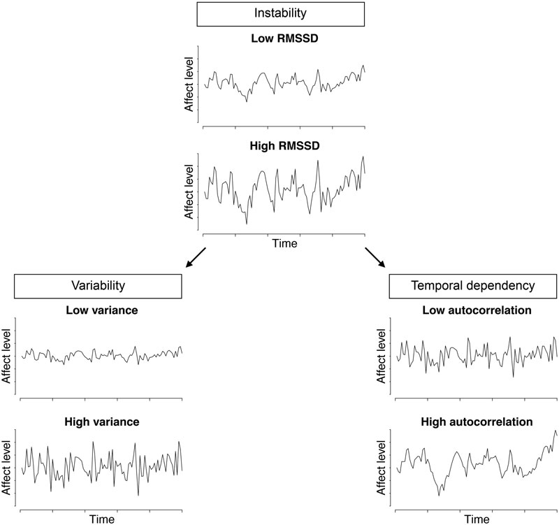

# 第六章：数据分析与建模

## 6.1 嵌套数据结构与传统统计学的失效

面对生态瞬时评估（EMA）产生的大规模、密集型追踪数据，跨学科（健康科学、心理学、社会科学）的新手研究者常因缺乏合适的统计学范式而陷入误区。EMA 数据本质上是一种典型的长格式（Long-format）数据集。一个常见的错误做法是将同一个体在两周内收集的数十次测量值进行简单的均值聚合，随后使用传统的 OLS 回归或方差分析（ANOVA）进行检验。这种做法不仅抹杀了 EMA 研究最为珍贵的时间动态演变信息，更严重违背了经典统计学中关于"残差独立性"的基本假设。由于同一个体在相近时间点上的行为、情绪或生理状态存在高度的自相关性，简单聚合会导致标准误的严重低估，进而引发第一类错误（假阳性）的激增。

EMA 数据天然具有嵌套（Nested）特征，即瞬时测量层（Level 1：如当前时刻的心率、当下的焦虑打分或环境特征）嵌套于个体特征层（Level 2：如患者的性别、稳定的特质性焦虑、社会经济地位）之中。为了正确解析这种"俄罗斯套娃"式的数据结构，研究者必须采用多层线性模型（Multilevel Modeling, MLM），也称为混合效应模型（Heck & Thomas, 2020）。Luna 等人（2025）的系统综述证实，**MLM 已成为 EMA 数据分析中绝对主流的方法**：在其检出的统计方法中，使用 MLM 的文章（66 篇）远超其他方法（逻辑回归 24 篇、机器学习 22 篇、动态回归 5 篇、向量自回归 VAR 1 篇等）。

## 6.2 数据预处理与多层线性模型分析步骤

在进入多层模型构建之前，严谨的数据预处理与变量中心化（Centering）是确保模型收敛与结果解释正确的关键前提。以精神病学领域为例，Schoevers 等人（2021）正是运用这一套流程，成功提取了抑郁症患者在真实世界中微小的情绪波动特征，并揭示了其作为复发预测因子的临床价值。这一套分析流程同样完全适用于公卫领域中身体活动与疲劳的动态建模。

具体的操作分析步骤如下：

- **步骤一：无效响应过滤与缺失值评估**。通过 R 语言脚本剔除作答时间低于合理认知加工时长的条目（如 3 秒内填完 10 道题）。计算个体的整体依从性，依据预设阈值（如 < 33%）剔除不合格样本。随后评估剩余缺失数据的机制：判断其为完全随机缺失（MCAR）、随机缺失（MAR）还是非随机缺失（MNAR）。由于 EMA 中缺失常与症状状态相关（如情绪低落时更可能漏填），完全随机缺失的假设往往不成立，需在建模阶段对缺失加以考虑。
- **步骤二：执行组内中心化（CWC）**。针对 Level 1 的瞬时变量，执行组内中心化（Centering Within Clusters），即用受试者每次的报告值减去该受试者在整个研究期间的均值。这一操作能够精准隔离出个体内纯粹的状态波动，用于回答"你此刻是否比你平时的平均状态更加焦虑（或更有运动意愿）"等问题。
- **步骤三：执行组间中心化（CGM）**。针对 Level 2 的个体变量，执行组间中心化（Centering at the Grand Mean），即用个体的平均值减去全体样本的总均值，以纯粹考察个体间的特质性差异。在实操中，研究者应在论文中明确报告中心化方式——Luna 等人（2025）发现，仅约半数研究同时报告了两种中心化（49%），其余或仅报告一种、或完全未报告，这种不透明会严重妨碍结果的可比性。
- **步骤四：构建与比较多层线性模型**。使用 R 语言中的 `lme4` 包，首先建立无预测变量的零模型（Null Model）计算组内相关系数（ICC），评估使用 MLM 的必要性。ICC 衡量总变异中由个体间差异解释的比例，取值介于 0–1；ICC 越大（经验上 > 0.10），表明数据嵌套性越强，越有必要采用多层模型。随后依次加入 Level 1 与 Level 2 的固定效应（Fixed effects），并通过设定随机斜率（Random slopes）来允许变量间的关系在不同个体中存在异质性。模型的随机效应结构、误差协方差结构与拟合评估均应在论文中完整报告（Luna et al., 2025）。
- **步骤五：动态特征提取（Feature Extraction）**。除了均值比较，研究者需进一步计算均方连续差（MSSD）和一阶自回归系数（AR(1)），以量化目标变量（如情绪、疼痛感）的不稳定性（Instability）和惯性（Inertia）。

*图6-1：EMA 动态特征的三类量化维度——不稳定性（RMSSD）、变异性（方差）与时序依赖（自相关）。引自 Schoevers et al.（2021），*Psychological Medicine*，[DOI: 10.1017/S0033291720000689](https://doi.org/10.1017/S0033291720000689)，CC BY 4.0 许可。*

对于初学者，强烈推荐访问开源的 [APH EMA Handbook](https://jruwaard.github.io/aph_ema_handbook/)，该教程提供了上述所有预处理与建模步骤的完整 R 代码示例。

## 6.3 动态过程的量化与扩展方法

EMA 的核心价值在于刻画心理过程的**动态性**，而不仅是平均水平。除 6.2 中提到的 MSSD 与 AR(1) 外，研究者还可依据研究问题选择更丰富的动态指标：

- **不稳定性（Instability）**：通常以均方连续差（MSSD）或个体内标准差（ISD）衡量，反映情绪或症状在相邻时点间的波动幅度。
- **惯性（Inertia）**：通常以一阶自回归系数 AR(1) 衡量，反映情绪状态从一时点到下一时点的"黏滞"程度——惯性越强，情绪越难以从当前状态中恢复。
- **极端波动与跨时滞效应**：通过时滞（Lag）变量考察变量 A 在 t 时刻是否预测变量 B 在 t+1 时刻的变化（如压力→情绪的时间因果顺序）。
- **网络与系统方法**：对于多变量 EMA 数据，可采用动态网络分析、群体迭代多模型估计（GIMME）或向量自回归（VAR）模型，刻画症状或情绪之间随时间推移的相互影响结构（Luna et al., 2025）。这类方法在精神病理学研究中日益普及，但其样本量要求与分析复杂性也显著更高。

需要强调的是，选择何种动态指标应**由理论假设驱动**而非数据驱动：若研究关注情绪的恢复能力，优先选择 AR(1)；若关注波动的剧烈程度，优先选择 MSSD。同时，移动认知任务数据（如反应时、准确率）的个体内变异性（IIV）本身即可作为认知稳定性的指标进行分析（Luna et al., 2025）。

## 6.4 多层模型报告的透明化

数据分析的严谨性不仅体现在方法选择上，更体现在**报告透明度**上。Luna 等人（2025）对已发表 EMA 研究的系统审查发现，MLM 的报告普遍存在不一致：

- **中心化方式**：仅 49% 的研究同时报告 person-mean 与 grand-mean 中心化，21% 仅报告 person-mean 中心化，7% 仅报告 grand-mean 中心化，其余未报告。
- **关键参数**：仅约 61–64% 报告了 ICC；固定效应是否标准化、随机效应的估计、误差协方差结构（14–16%）、模型拟合评估（21–44%）与假设检验（21–23%）的报告率均偏低。
- **CREMAS 依从性**：研究对 CREMAS 规范的总体依从率从 23% 到 100% 不等，其中"结果"部分的依从性最差——流失率（40%）、提示投递（38%）与缺失数据（< 40%）的报告率普遍不足。

为此，Luna 等人（2025）在 CREMAS 基础上提出了一套针对 MLM 的报告建议（REMMES），要求研究者至少透明报告：数据预处理与中心化方式、模型设定（固定效应、随机效应、误差协方差结构）、模型拟合评估、假设检验（如残差正态性）、以及效应量。研究者应将这些要素视为论文方法部分的"强制条目"，以保障研究结果的可重复性与跨研究可比性。

## 6.5 参考文献

- Heck, R. H., & Thomas, S. L. (2020). *[An Introduction to Multilevel Modeling Techniques](https://www.routledge.com/An-Introduction-to-Multilevel-Modeling-Techniques-MLM-and-SEM-Approaches/Heck-Thomas/p/book/9780367182427)* (4th ed.). Routledge.
- Singer, J. D., & Willett, J. B. (2003). *[Applied Longitudinal Data Analysis: Modeling Change and Event Occurrence](https://global.oup.com/academic/product/applied-longitudinal-data-analysis-9780195152968)*. Oxford University Press.
- Luna, C., et al. (2025). Examining intra-individual variability of ecological momentary assessment with multilevel modeling: A systematic review. *The Clinical Neuropsychologist*. [PMID: 41370712](https://pubmed.ncbi.nlm.nih.gov/41370712/)
- Liao, Y., Skelton, K., Dunton, G., & Bruening, M. (2016). A systematic review of methods and procedures used in ecological momentary assessments of diet and physical activity research: CREMAS. *Journal of Medical Internet Research*, 18(6), e151. [DOI: 10.2196/jmir.4954](https://doi.org/10.2196/jmir.4954)
- Schoevers, R. A., van Borkulo, C. D., Lamers, F., et al. (2021). Affect fluctuations examined with ecological momentary assessment in patients with current or remitted depression and anxiety disorders. *Psychological Medicine*, 51(11), 1906–1915. [DOI: 10.1017/S0033291720000689](https://doi.org/10.1017/S0033291720000689)
