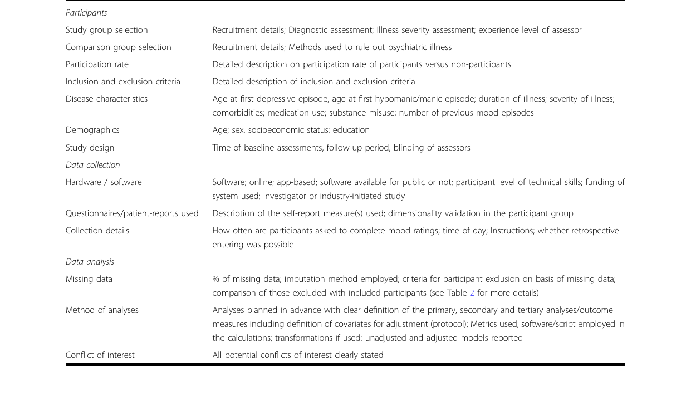

# 第七章：报告撰写与学术发表

## 7.1 可重复性危机与透明化报告的必然性

生态瞬时评估（EMA）技术在多学科（心理学、精神医学、行为健康、公共卫生）领域的爆炸式应用带来了一个威胁研究根基的严峻问题：大量已发表的论文在其实施细节上含糊其辞，导致同行根本无法对其结果做重复验证。EMA 研究涉及很繁复的设计参数，从底层软件的算法逻辑、传感器的采样频率，到受试者的依从性阈值以及多层嵌套数据的缺失值处理方案。如果在撰写论文的方法（Methods）和结果（Results）部分仅仅做框架性的概括，这种"选择性报告"不仅掩盖了潜在的方法学瑕疵，更是直接损害了研究的科学价值。

这种担忧已得到实证数据的支持。Trull 与 Ebner-Priemer（2020）对精神病理学领域三项主要期刊近七年的日常评估（Ambulatory Assessment, AA）研究做系统审查后发现，**报告实践存在很大差异**，大量研究未充分披露设备、软件、采样设计与依从性等关键细节。Luna 等人（2025）在第六章中也指出，即便是在已发表的 EMA 研究论文中，MLM 的中心化方式、ICC、随机效应等统计细节的报告率也普遍偏低（详见第六章 6.4 节）。

为应对这一危机，学术界先后制定了多套报告规范，从 Stone 与 Shiffman（2002）的瞬时自我报告指南，到 Liao 等人（2016）的 CREMAS、Burger 等人（2022）的 STROBE-EMA，再到面向特定领域的 eMOOD 与 STROBE-GEMA 等扩展规范。目前，遵循此类规范已被诸多跨学科的顶级期刊（如《JAMA Psychiatry》、《Journal of Medical Internet Research》）确立为不可逾越的审稿红线。

## 7.2 报告规范体系：从通用到专用

EMA 报告规范已经形成一个"基础指南 → EMA 专用清单 → 领域扩展"的层次化体系，研究者应根据自身研究特点选用相应的规范。

### 7.2.1 基础报告指南

- **Stone & Shiffman（2002）**：早期提出的瞬时自我报告报告指南，要求研究者至少披露采样方案的理论依据、采样密度与时间表、提示与记录方法、受试者主动发起条目的定义、非响应（Nonresponse）的处理方式、响应延迟允许范围、"及时响应"的界定、依从率及其客观评估方式、受试者培训与监测程序、缺失数据的处理标准。该指南是后续所有 EMA 报告规范的源头。

### 7.2.2 EMA 专用核查清单

- **CREMAS（Liao et al., 2016）**：基于对 13 项青少年饮食与体力活动 EMA 研究的系统回顾，构建了覆盖抽样与测量、时间表、技术与实施、提示策略、响应与依从性五大领域的核查清单，是当前应用最广的 EMA 报告规范之一。其与采样设计直接相关的条目（提示策略类型、按工作日/周末报告提示频率、计划投递与实际接收提示数、潜伏期、依从率及其与人口学/时变变量的关联）详见第二章 2.7 节。
- **STROBE-EMA（Burger et al., 2022）**：在经典的流行病学观察性研究报告规范 STROBE 基础上，针对高频密集纵向数据量身定制，是当前最全面、也是多数顶刊明确要求采用的 EMA 报告规范。研究者可通过 Open Science Framework（OSF）下载最新版 Checklist。

### 7.2.3 领域扩展规范

- **eMOOD（Faurholt-Jepsen et al., 2019）**：面向心境障碍（如双相障碍）研究中远程采集的电子心境数据（Electronic Mood Data），其清单覆盖参与者（诊断评估、纳入排除标准、疾病特征、人口学）、研究设计（基线评估、随访、盲法）、数据采集（硬件/软件、问卷、收集细节）与数据分析（缺失数据、预设的分析方法、利益冲突）等模块，并特别关注情绪不稳定性（Mood instability）的数学量化。
- **STROBE-GEMA（Kingsbury et al., 2024）**：针对将瞬时自评与 GPS 定位数据连接、用于测量环境暴露的"地理显式瞬时评估"（Geographically Explicit Momentary Assessment, GEMA），在 STROBE 基础上新增了 32 个 GEMA 特有条目，共整合 70 个条目，覆盖地理精度、GPS 缺失与误差等独特议题。
- **Trull & Ebner-Priemer（2020）**：针对精神病理学领域的日常评估研究，整合既有最佳实践并归纳为六大报告模块：样本选择与规模、采样设计、测量选择与报告、设备与软件、依从性，以及统计分析，可作为 STROBE-EMA 在临床精神病理场景的补充。

## 7.3 遵循 STROBE-EMA 规范的写作与自查步骤

在论文定稿前，研究者必须严格按照以下步骤完成自查与信息披露：

- **步骤一：硬件与软件环境的彻底披露**。在"研究设备"小节，必须清晰交代所使用的应用程序名称、版本、服务器环境，以及是否允许被试使用自有设备（BYOD - Bring Your Own Device）。若使用可穿戴传感器（如活动记录仪或心率带），需注明设备的具体型号与采样频率（Hz）。Trull 与 Ebner-Priemer（2020）的报告模块同样将"设备与软件"列为必须披露的核心内容。
- **步骤二：采样参数及其理论辩护**。在"研究设计"小节，不仅要写明采用了何种触发机制（固定、随机或事件触发），更要详细说明参数设定的依据。比如，必须明确披露每次弹窗通知的超时限制（Time-out limit，如 15 分钟内未作答即视为数据缺失），并解释为何选择每天 6 次而非 3 次的推送频率（如基于目标情绪或饮食冲动的半衰期）。
- **步骤三：合规性阈值与缺失数据机制报告**。在"数据清洗"小节，必须明确定义什么是"有效完成率"，公开计算该指标的分子与分母。必须如实报告最终纳入分析样本的平均回复率及其标准差。更重要的是，需详细说明缺失数据的处理机制，评估数据是符合完全随机缺失（MCAR）、随机缺失（MAR）还是非随机缺失（MNAR）假设。eMOOD 指南同样要求报告缺失数据比例、插补方法与剔除标准。
- **步骤四：统计模型参数的精确描述**。在"统计分析"小节，必须明确列出多层线性模型（MLM）的数学公式。清晰交代固定效应与随机效应的协方差结构设定依据，并详细说明对 Level 1 变量和 Level 2 变量分别采用了何种中心化（Centering）策略。此处的报告要求与第六章 6.4 节的 REMMES 建议相互衔接。

*图7-1：eMOOD 报告指南检查单（节选），涵盖参与者、研究设计、数据采集、数据分析与利益冲突等报告模块，供研究者逐项核对。引自 Faurholt-Jepsen et al.（2019），*Translational Psychiatry*，[DOI: 10.1038/s41398-019-0484-8](https://doi.org/10.1038/s41398-019-0484-8)，CC BY 4.0 许可。*

对于准备发表成果的研究者而言，建议在撰写草稿的第一天起，就应将相应报告清单作为"飞行前检查单"逐一核对。这不仅是应对严苛审稿的防御性策略，更是为自身的学术成果构筑可重复性的坚实基础。

## 7.4 报告规范的选择与投稿策略

不同的 EMA 研究类型适用不同的报告规范，研究者可按以下路径选择：

- **常规 EMA 研究**：优先采用 **STROBE-EMA** 作为核心核查清单，并辅以 **CREMAS** 复核采样设计细节。
- **心境障碍相关的电子数据监测**：在 STROBE-EMA 基础上，补充 **eMOOD** 中关于诊断评估、疾病特征与情绪不稳定性的报告要求。
- **纳入地理定位的环境暴露研究**：采用 **STROBE-GEMA**，确保 GPS 采集、地理精度与缺失处理得到充分披露。
- **精神病理学人群研究**：参考 **Trull & Ebner-Priemer（2020）** 的六大报告模块，逐项检查样本、测量、设备与依从性的报告完整性。
- **投稿前核查**：登录 Open Science Framework（OSF）下载最新版 Checklist，逐条勾选；部分期刊还要求将填写完成的清单作为补充材料随稿提交。

## 7.5 参考文献

- Burger, J., et al. (2022). STROBE-EMA: Reporting guidelines for ecological momentary assessment studies. *OSF Preprints*. [DOI: 10.31234/osf.io/c95xb](https://doi.org/10.31234/osf.io/c95xb)
- Faurholt-Jepsen, M., et al. (2019). Reporting guidelines on remotely collected electronic mood data in mood disorder (eMOOD)—recommendations. *Translational Psychiatry*, 9, 162. [DOI: 10.1038/s41398-019-0484-8](https://doi.org/10.1038/s41398-019-0484-8)
- Kingsbury, C., et al. (2024). STROBE-GEMA: A STROBE extension for reporting of geographically explicit ecological momentary assessment studies. *Archives of Public Health*, 82, 84. [PMID: 38867286](https://pubmed.ncbi.nlm.nih.gov/38867286/)
- Liao, Y., Skelton, K., Dunton, G., & Bruening, M. (2016). A systematic review of methods and procedures used in ecological momentary assessments of diet and physical activity research: CREMAS. *Journal of Medical Internet Research*, 18(6), e151. [DOI: 10.2196/jmir.4954](https://doi.org/10.2196/jmir.4954)
- Luna, C., et al. (2025). Examining intra-individual variability of ecological momentary assessment with multilevel modeling: A systematic review. *The Clinical Neuropsychologist*. [PMID: 41370712](https://pubmed.ncbi.nlm.nih.gov/41370712/)
- Stone, A. A., & Shiffman, S. (2002). Capturing momentary, self-report data: A proposal for reporting guidelines. *Annals of Behavioral Medicine*, 24(3), 236–243. [PMID: 12173681](https://pubmed.ncbi.nlm.nih.gov/12173681/)
- Trull, T. J., & Ebner-Priemer, U. W. (2020). Ambulatory assessment in psychopathology research: A review of recommended reporting guidelines and current practices. *Journal of Abnormal Psychology*, 129(1), 56–63. [DOI: 10.1037/abn0000473](https://doi.org/10.1037/abn0000473)
